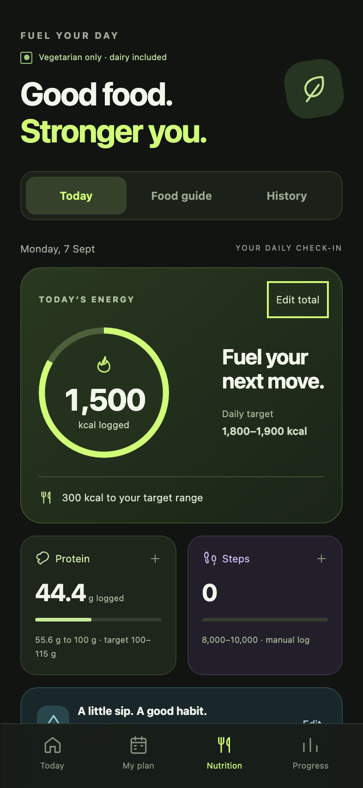
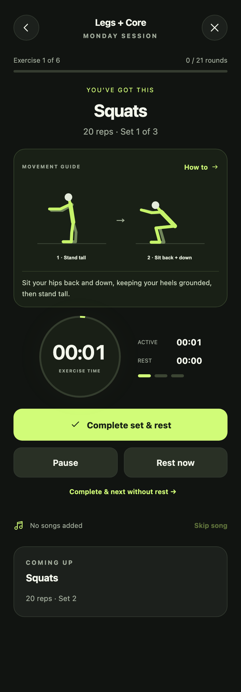

# FORM — personal gym companion

An offline Android gym companion with guided workouts, original SVG exercise illustrations, vegetarian nutrition tracking, streaks, and local music playback.

**Current version: 1.2.1.** This is a personal MVP, with native hardware validation still pending.

[Installation guide](docs/INSTALLATION.md) · [Architecture and engineering details](docs/ARCHITECTURE.md) · [Development and build guide](docs/DEVELOPMENT.md) · [Testing and limitations](docs/TESTING.md)

 

Screenshots use sample test data. No user history or music is bundled.

## Download

A public APK release has not been uploaded yet. To build `FORM.apk` yourself, follow the [development guide](docs/DEVELOPMENT.md). Build output is written to `output/FORM.apk`; generated APKs are distributed as release assets rather than checked into Git.

## Install on your Samsung S23+

1. Build the app using the development guide, then copy `output/FORM.apk` to your phone.
2. Open the APK in Samsung **My Files → Downloads** (or the folder you copied it to).
3. If Android asks, allow **Install unknown apps** for My Files, then tap **Install**. You can revoke that permission afterward.
4. Open **FORM**. The home screen automatically selects the current local day.
5. Tap **Add music → Add songs from your phone**, then select your MP3 files. Start your workout from Today.

This is a personally signed APK, not a Play Store release. No account or internet access is needed. Android 8.0+ is supported; the build targets Android 15. The APK contains no native CPU-specific libraries.

## Update to version 1.2.1

Install the new `output/FORM.apk` over the previous FORM build. It uses the same package and local signing key with a higher version code, so Android can update it in place while retaining saved data. Do not uninstall the old version first.

Version 1.2.1 makes the vegetarian-only preference explicit across Nutrition, Food Guide, meal logging and Settings. All 15 built-in food options are vegetarian with dairy included, and no eggs, meat or fish. Tofu and protein powder remain excluded by your earlier preference. Custom meal names are entered by you; the app does not infer ingredients or certify arbitrary recipes.

Version 1.2 adds a redesigned nutrition dashboard, meal logging with edit/repeat/remove, quick water buttons with undo, nutrition history, and an illustrated food guide. Prior manual totals remain a separate baseline and stay included. Logging a meal adds its values to that baseline; edit/remove the entry to correct it. Direct total edits cannot fall below logged entry values. Calorie/protein values come from the user’s label or recipe, not generated food estimates.

Version 1.1 added original exercise illustrations and instructions. Diagrams show key positions, not a timed animation or automatic form assessment. The generic Stretching entry shows a labeled calf-stretch example; the original PDF does not specify a stretching sequence.

## What works

- Sunday-first weekly plan, automatically selected by local date; every other day is available to preview or start.
- Exercises in PDF order, all sets, timed holds, and separately timed left/right side planks.
- Original offline SVG illustrations for each exercise, thumbnails in My Plan, and a larger movement diagram during sets and rest.
- Tap an exercise or How to for setup cues, numbered movement steps and a form check. Opening a guide during a workout pauses the timer and music; closing it does not automatically resume.
- A stopwatch for rep-based exercises and a countdown for timed exercises.
- Complete set and rest, complete and start next, pause/resume, mid-set rest, extend rest, and skip rest.
- Rest defaults to 45 seconds. At zero, the app waits for you to start the next set.
- Timed sets pause at their target and wait for confirmation. Add 10 seconds if needed.
- Separate exercise/rest durations, individual set logs, complete and partial session history.
- Locally saved session recovery. Returning to a saved workout requires an explicit Resume.
- Streaks use completed local calendar dates. Wednesday recovery counts; Saturday does not break the streak. Partial workouts do not count. Multiple workouts on one date count once.
- Manual daily totals for calories, protein, water and steps, plus meal entries and one-tap water additions.
- Edit or remove meals, repeat previous meals, and browse nutrition history. Protein supports decimals.
- Illustrated food cards with Staples, Dairy and Snacks filters, preserving the exact food lists you supplied.
- Multiple local audio files through Android’s file picker, remembered after restarting, random selection without immediate repeats where possible, and a Skip song button.
- Music plays during exercise, pauses during rest or pause, and resumes with exercise. The next random song plays when a song ends.
- Music and timers pause when you leave the app, lock the screen, lose audio focus, or unplug headphones. The workout screen stays awake during exercise and rest while the app is foregrounded.
- JSON export of workout, nutrition and settings data. This version provides export only; there is no in-app backup restore or cloud sync.

Keep selected music files available at their original location. Moving/deleting them or removing their document provider can revoke access; re-import them if that happens. No MP3 files are bundled. Import your own files on the phone. Cancelling the picker leaves your library unchanged.

## Plan source and choices

Source: the project owner’s supplied “SixPacks Excersice - Google Sheets” PDF. The complete routine is transcribed below; the original personal document is not needed to build or run the app.

| Day | Focus | Exercises |
| --- | --- | --- |
| Sunday | Chest + Abs | Push-ups 3 × 12; pike push-ups 3 × 8; chair dips 3 × 10; crunches 3 × 20; leg raises 3 × 12; plank 3 × 40 sec |
| Monday | Legs + Core | Squats 3 × 20; reverse lunges 3 × 10/leg; glute bridges 3 × 20; wall sit 3 × 40 sec; mountain climbers 3 × 30 sec; side plank 3 × 30 sec/side |
| Tuesday | Back + Abs | Backpack rows 3 × 15; superman 3 × 15; reverse snow angels 3 × 12; bicycle crunches 3 × 20; leg raises 3 × 12; plank 3 × 45 sec |
| Wednesday | Recovery | Walking 30–45 min; stretching 10 min |
| Thursday | Full Body + Abs | Push-ups 3 × 12; squats 3 × 20; backpack rows 3 × 15; lunges 3 × 10/leg; chair dips 3 × 10; leg raises 3 × 15; plank 3 × 45 sec |
| Friday | Conditioning + Abs | Jumping jacks 4 × 45 sec; high knees 4 × 30 sec; mountain climbers 4 × 30 sec; burpees 4 × 8; crunches 4 × 20; hollow-body hold 3 × 20–30 sec |
| Saturday | Rest | No workout |

Friday’s PDF heading is clipped to “Conditioning + A”; the app expands it to “Conditioning + Abs”. Recovery walking defaults to 30 minutes and hollow holds to 25 seconds, both adjustable within the supplied ranges in Settings. Rest duration was not specified in the PDF and is adjustable. Rep-based unilateral exercises show reps per leg; you complete both legs before marking the set complete.

Nutrition targets are the user's supplied numbers, not independently prescribed health advice. The app does not promise six-pack results or estimate calorie burn. Steps are manual, not read from Samsung Health or a pedometer.

The referenced [Gym Workout Tracker](https://play.google.com/store/apps/details?id=gymworkout.gym.gymlog.gymtrainer&hl=en_IN) informed the plan/log/rest flow. FORM has its own interface and bundled vector graphics; no assets were copied.

## Project

- `app/src/main/java/com/sixpack/trainer/MainActivity.java`: Android shell, private preferences, document picker, audio focus and MediaPlayer.
- `app/src/main/assets/core.js`: weekly plan, deterministic workout state machine, calendar/streak logic.
- `app/src/main/assets/app.js`: UI, daily tracking, session history and native bridge.
- `app/src/main/assets/styles.css`: responsive mobile layout.
- `app/src/main/assets/exercise-visuals.js`: original SVG poses, direction arrows, hold diagrams and exercise thumbnails.
- `app/src/main/assets/exercise-guides.js`: setup cues and source metadata for all planned movements.
- `tests/core.test.cjs`: meaningful calendar, timing and progression tests.
- `tests/ui.test.cjs`: complete user-flow tests and screenshots.
- `tests/visuals.test.cjs`: exercise coverage and native asset loading checks.
- `app/src/main/assets/nutrition.js`: meal/water totals, migration of old daily logs, and entry validation.
- `tests/nutrition.test.cjs`, `tests/nutrition-ui.test.cjs`: total integrity, historical dates, migration, journal flows, and mobile layout.

The APK bundles all UI files behind an intercepted private HTTPS origin in WebView. Only seven known asset paths are served; external requests and navigation are blocked. There is no INTERNET permission, broad storage permission, analytics, advertising, remote dependency, or server. Android Preferences store the actual app data; browser localStorage is only used by the desktop preview.

## Build

Gradle configuration is included for Android SDK 35, Java 17, Android Gradle Plugin 8.7.3, and Gradle 8.9, but no Gradle wrapper is bundled and the Gradle path has not been validated. The delivered APK uses the verified manual macOS build below. See [development](docs/DEVELOPMENT.md) for requirements and clean-clone setup:

```sh
./scripts/build-apk.sh
```

The manual build uses official Google Android Platform 35 and Build Tools 35.0.0 under `.toolchain/sdk`. Downloads were verified against checksums in Google's repository metadata. To recreate that toolchain on macOS:

```sh
bash scripts/setup-android-sdk.sh
npm run build:apk
```

Platform archive SHA-1: `0bb560a90a7a2cbd0dd8348224d518b638fe7949`. Build tools archive SHA-1: `93ab8ce91230e067b5add4bfa79919c52b27f072`.

The local build key is in `.local-signing/form.keystore` (alias/password `form`/`android`). It is a development key for this personal installation, not a production release credential. Preserve your key for updates over builds you sign yourself. A fresh clone generates a different key from the published release. Android Studio's default debug signing key differs; switching keys requires uninstalling the old build and loses its local data. Key and SDK files are excluded from Git.

## Preview and checks

```sh
npm ci
npx playwright install chromium
npm test
npm run preview
# In a second terminal:
npm run test:ui
```

The preview runs at `http://127.0.0.1:4173`. Browser audio imports only last for that tab; persistent document access is an Android feature.

Validated: 19 unit checks across workout, illustration and nutrition logic; complete nutrition UI checks for adding/editing/repeating/removing meals, water/undo, blank validation, preserved manual totals, reload, history, food filters and narrow screens; all 46 full/thumbnail SVGs parsed and rendered; browser end-to-end flows for all 21 Monday rounds, pause/rest/resume, persistence, nutrition logging, history, and real audio playback/pause/resume using a generated audio fixture; guide opening pauses active/rest timers and audio, guide closing requires explicit workout resumption, and keyboard focus stays inside the guide; 320px and 393px layout screenshots; Java compilation; APK package metadata; APK signature schemes v2/v3. No browser JavaScript errors were reported.

Not yet validated on an Android emulator or a physical phone: native file picker, persistent song permissions, actual Android MediaPlayer playback/audio interruptions, and Samsung system insets. These still need a first run on your S23+. The browser tests do not substitute for a physical Android audio test.

Version 1.2 also fixes blank totals accidentally resetting a log, pins open total-entry forms to the date on which they were opened, updates browser song titles immediately, and prevents the page from scrolling behind an open dialog. Native Android hardware testing remains pending.
