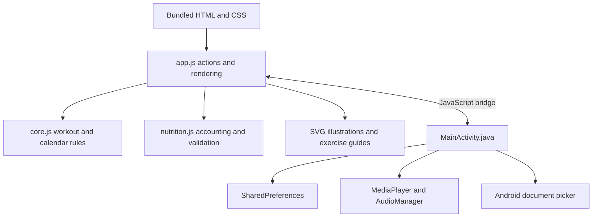

# Architecture and implementation

FORM is an offline hybrid Android app. Java hosts a WebView and exposes a small native bridge. Bundled HTML/CSS/JavaScript provide the UI and domain logic. The JavaScript runs in the WebView's Chromium/V8 runtime; Chrome does not need to be open. No Node.js, development server, or internet connection is needed on the phone.

## Technologies actually used

| Area                      | Implementation                                                                  |
| ------------------------- | ------------------------------------------------------------------------------- |
| Android host              | Java Activity; Android framework APIs                                           |
| Interface                 | HTML, CSS, plain JavaScript; no React or Vue                                    |
| Illustrations             | Original SVG paths and pose helpers                                             |
| Workouts                  | Mutable JavaScript Session state machine                                        |
| Nutrition                 | Baseline plus meal/water journal entries                                        |
| Persistence               | JSON in Android SharedPreferences; browser localStorage in preview              |
| Audio                     | Android MediaPlayer and AudioManager; HTML Audio in preview                     |
| File access               | ACTION_OPEN_DOCUMENT and persistent URI permission                              |
| Native bridge             | addJavascriptInterface and evaluateJavascript                                   |
| Tests                     | Node node:test/assert, Playwright/Chromium                                      |
| Build                     | JDK 17, Android Platform 35, Build Tools 35.0.0, aapt2, d8, zipalign, apksigner |
| Alternative configuration | AGP 8.7.3 / Gradle 8.9; not the verified release build path                     |
| Development tools         | Shell, ripgrep, Python, Poppler PDF extraction/rendering, browser screenshots   |

## Layers



`index.html` loads the modules in order. The domain libraries expose browser globals and CommonJS exports so the same logic can be tested with Node. `app.js` dispatches `data-action` buttons, coordinates state changes/persistence/audio, and renders HTML. It updates timer text between full renders.

## Workout plan and execution

`core.js` stores the weekly routine as data. Each exercise contains `name`, `sets`, a display `amount`, optional `seconds`, and optional `sides`. `stepsFor()` expands it into the execution queue. All sets of one exercise precede the next exercise. Monday has 18 prescribed sets but 21 execution rounds because each of the three side-plank sets contains two sides.

A Session contains its plan snapshot, current index, phase, active milliseconds, rest milliseconds, current-round milliseconds, remaining rest, and completed round logs.

| Phase    | Meaning                                                          |
| -------- | ---------------------------------------------------------------- |
| work     | Exercise time accumulates                                        |
| rest     | Rest time accumulates and its countdown decreases                |
| paused   | Work or rest is stopped; beforePause identifies the return state |
| ready    | Rest has ended; explicit user action starts the next round       |
| setDone  | Timed exercise reached its target and needs confirmation         |
| finished | All rounds completed                                             |

The UI ticks about every 200 ms. Session computes `max(0, now - last)` instead of assuming every callback arrives on time. Timed rounds clamp that delta to their remaining duration. `Date.now()` is currently the clock: a monotonic clock is a documented improvement, because wall-clock adjustments can distort durations.

Completion checks the phase before logging a round. A final history record is deduplicated by session ID. This is not complete command idempotency: rapid repeated completion without rest could advance successive rounds. Stable step IDs and expected-step commands would improve this.

## Persistence and lifecycle

The main snapshot holds settings, daily nutrition, history, and the current session. The song library uses a separate preference key. Important transitions save immediately; a session also triggers periodic checkpoints around once per second. Serialization stores plain JSON; `Session.restore()` restores the prototype and forces running work/rest into paused state.

Android onPause, browser visibility changes, lost audio focus, and headphone disconnection pause the session. The foreground workout screen stays awake. These lifecycle paths are implemented, but real-device validation remains pending. Abrupt process death may lose uncheckpointed progress; this is not zero-loss storage.

SharedPreferences writes serialize the whole snapshot and the bridge does not return a structured persistence acknowledgement. This can lead to optimistic UI success messages on disk-write failure. A repository, asynchronous acknowledgements, and a database are future work.

## Nutrition accounting

The invariant is:

```text
Daily total = manual baseline + sum of meal/water entries
```

Older total-only records migrate into `manual` once. Editing a meal replaces its contribution. Removing it preserves the baseline. Repeating a meal creates a new ID. Water quick-add creates an entry that undo can remove. Editing an overall total recomputes the baseline and rejects values below the journal's sum.

Calories and steps are whole numbers; protein and water support decimals. Totals are rounded to two decimal places. Validation rejects missing names, invalid meal categories, negative/non-finite values, and unsupported totals. Open forms retain their business date across midnight. Numeric limits in code are validation bounds, not health targets.

The food catalog is vegetarian with dairy; tofu and protein powder are also excluded. User-entered recipes are not ingredient-validated. Nutrition values come from the user, not an estimation service.

## Calendar and streak rules

History stores calendar dates and timestamps. Streak calculation deduplicates completed local dates, skips Saturday without adding a day, counts completed recovery sessions, and stops on a missed required day. Today's unfinished workout does not immediately erase yesterday's streak. Partial sessions do not count. Completion date determines streak attribution, with start date also retained. Timezone/travel rules need further product definition and testing.

## Music and asynchronous work

The desired playback state is derived from a visible session whose phase is work. Native code independently checks foreground state and audio focus. MediaPlayer prepares asynchronously; stale callbacks are ignored with `if (player != mp) return`, and prepared playback checks whether music is still wanted.

Random choice excludes the previous song where alternatives exist; it is not a shuffle bag. File import retains content URI access instead of copying MP3s. Deleted/moved files can require re-import. There is no media service or background playback. JSON quoting protects strings passed back into JavaScript.

## SVG illustrations and accessibility

23 exercise names each have full and compact SVG views. Shared helpers draw bodies, limbs, floors, equipment and arrows. Static position labels explain movements; side-plank support side is explicit. Stretching shows a labeled calf-stretch example, not a prescription to hold it for ten minutes. Reference metadata for movement cues lives in exercise-guides.js; illustrations are original code.

Dialogs make the underlying app inert, contain keyboard focus, support Escape, and restore focus on close. Exercise instructions pause the session before opening. CSS supports narrow screens; further font-scale, screen-reader and device testing is still necessary.

## Security and privacy boundaries

The WebView serves exactly seven allowlisted assets under an intercepted HTTPS origin. It blocks external navigation and requests, disables WebView file/content access, and has a Content Security Policy. Android declares no INTERNET or broad storage permission. Dynamic user strings are HTML-escaped; bridge callback strings are JSON-quoted.

A native JavaScript bridge remains a sensitive boundary and has not undergone a security audit. Stored JSON is not separately encrypted by the app. Exports contain personal logs; no records, music, tokens or signing keys are in the repository.

## Building and updates

The verified manual build compiles Android resources with aapt2, compiles Java with javac, converts bytecode with d8, assembles assets/resources/DEX into an APK, aligns it, signs it, then verifies it. Package identity, a higher versionCode, and the same signing certificate enable updates preserving data.

Current app version: 1.2.1, versionCode 4. App versioning and data schema versioning are separate concerns; the simple field-presence nutrition migration should become explicit versioned migrations as schemas grow.

## Hardening priorities

1. Android instrumentation and Samsung device tests, including process death and audio interruption.
2. Persistence acknowledgements, structured error handling, and backup restore.
3. Injected monotonic clock and expected-step command IDs.
4. Stable exercise IDs, typed models, explicit schema migrations, and smaller UI modules.
5. Repository/database storage for growing history and asynchronous I/O.
6. Reproducible standard release tooling, protected release keys, and broader accessibility checks.

A future native implementation could use Kotlin/Compose/ViewModel, Room for journal/history records, DataStore for settings, and Media3 for expanded media requirements. These are possible improvements, not technologies used by the current APK.

## References

- [Android architecture](https://developer.android.com/topic/architecture/recommendations)
- [Android WebView bridge security](https://developer.android.com/privacy-and-security/risks/insecure-webview-native-bridges)
- [Android clocks](https://developer.android.com/reference/android/os/SystemClock)
- [Room](https://developer.android.com/training/data-storage/room)
- [DataStore](https://developer.android.com/topic/libraries/architecture/datastore)
- [Media3](https://developer.android.com/media/media3/exoplayer)
